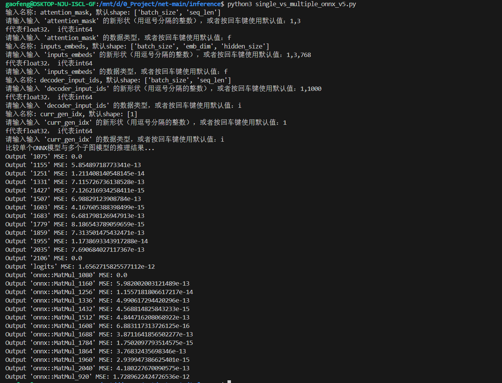

# ONNX 模型推理与结果对比

## 目录
- [1. 推理 1000 张图步骤](#1-推理-1000-张图步骤)
- [2. 推理结果对比](#2-推理结果对比)

## 1. 推理 1000 张图步骤

### 准备工作

#### 步骤 1：保存 PCA 代码
首先，将 `quant.py` 文件保存到当前目录中。

#### 步骤 2：准备 COCO 数据集提示
确保本地存在包含 COCO 数据集前 1000 个提示的 `prompts.txt` 文件。

### 推理过程

#### 步骤 3：运行推理脚本
我们将使用 `gen_images.sh` 脚本来运行 `inference_onnx.py` 和 `inference_pca.py` 各 1000 次，每次使用一个不同的提示。

- **原始图片生成**
  - 使用 `inference_onnx.py` 进行推理。
  - 生成的图片将保存在 `./output/origin` 文件夹中。
  - 运行命令：
    ```bash
    ./gen_images.sh
    ```

- **PCA 压缩图片生成**
  - 在 `gen_images.sh` 中取消注释 PCA 部分的代码。
  - 使用 `inference_pca.py` 进行带有 PCA 压缩的推理。
  - 生成的图片将保存在 `./output/pca` 文件夹中。
  - 同时，在 `./output/result` 文件夹中会生成 1000 个 `result_i.txt` 文件，每个文件保存了每个卷积层的输出。
  - 再次运行命令：
    ```bash
    ./gen_images.sh
    ```

### 结果分析

#### 步骤 4：计算 PSNR 和压缩率
编辑并运行 `images_MPS_COMP.py`，填入原始图片文件夹路径 (`./output/origin`) 和压缩后图片文件夹路径 (`./output/pca`)，记录卷积输出数据。

- 运行命令：
  ```bash
  python images_MPS_COMP.py
  ```

#### 步骤 5：计算 KID值
编辑并运行 `compare.sh`，就会得到 KID 值。
或者直接在命令行输入：
```
fidelity --gpu 0 --kid --input1 "./output/origin" --input2 "./output/pca"
```

## 2. 推理结果对比

### 推理工具说明

本部分介绍了一系列用于推理 ONNX 模型并比较其结果的 Python 脚本。这些脚本可以帮助用户评估不同模型配置下的性能差异。

#### model_inference.py
- **用途**：设计为支持一个输出的封装类函数。
- **适用场景**：只使用于只有一个输出的模型,在生成1000张图使用了该类。
- **如何使用**：根据您的模型和数据集调整参数后，直接运行该脚本即可。

#### model_inference_multiple_output.py
- **用途**：设计为支持多个输出的封装类函数。
- **适用场景**：使用于新的模型:`generation_model_simplify.onnx`，有多个输出层。
- **如何使用**：根据需要修改输入参数，然后执行脚本以获得所有预期的输出结果。

#### single_vs_multiple_onnx_v1.py
- **用途**：用于对比单个 ONNX 模型与拆分成多个 ONNX 模型的结果，同时也对比了PCA压缩结果。
- **适用场景**：只使用于只有一个输出的模型。
- **如何使用**：只需填入相应的模型路径，然后运行脚本，它将自动完成对比工作并输出结果。

#### single_vs_multiple_onnx_v2.py
- **用途**：对比单个 ONNX 模型与拆分成多个 ONNX 模型的结果，扩展了对 UNet 动态输入的支持，。
- **适用场景**：允许用户根据需求指定输入节点的形状，适用于需要灵活调整输入尺寸的情况。
- **特色功能**：提供了交互式的默认输入选项，用户在交互过程中按回车键即采用默认设置。
- **如何使用**：启动脚本后，按照提示操作，选择是否自定义输入节点形状或接受默认值。



---
